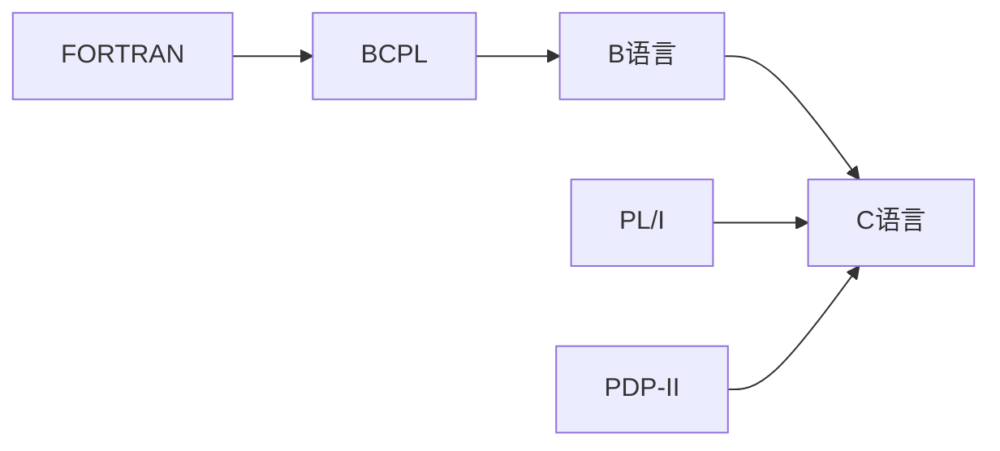

## 1. 程序设计与C语言
### 1.1 计算机和编程语言
#### 1.1.1 程序的执行
* 解释  
借助一个程序，那个程序能试图理解你的程序，然后按照你的要求执行。 
典型用例：Python
* 编译 
借助一个程序，就像一个翻译，把你的程序翻译成计算机真正能够懂的语言-机器语言。然后，用机器语言写的程序就能够被执行了。  
典型用例：C语言  

**注意：** 解释执行的语言也能够编译执行，编译执行的语言也能解释执行，只需要有对应的编译器和解释器就可以了。  
### 1.2 C语言
#### 1.2.1 C语言的基本历史

PL/I和PDP-II是对C语言影响非常大的机器语言。
#### 1.2.2 C语言的版本历史

**经典C：** K&R the C

